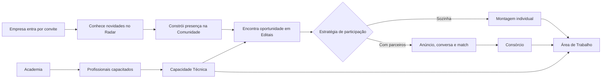

# LicitaHub — Mapa de Apresentação e Treinamento

## 1. Finalidade deste documento

Este mapa serve como base para:

- demonstração ao vivo do LicitaHub;
- apresentação comercial para possíveis clientes e associados;
- criação de slides;
- elaboração de apostila de treinamento;
- gravação de vídeos curtos por módulo;
- definição das capturas de tela necessárias.

O roteiro descreve a ação humana, a resposta do sistema, o registro gerado e o próximo passo do usuário.

## 2. Mensagem central do produto

O LicitaHub conecta empresas de engenharia consultiva e transforma oportunidades públicas em um fluxo contínuo de informação, relacionamento, formação de consórcios, organização da capacidade técnica, montagem de propostas e desenvolvimento profissional.

## 3. Estrutura da apresentação

Os seis módulos de valor são:

1. Radar LicitaHub.
2. Comunidade.
3. Editais.
4. Área de Trabalho.
5. Capacidade Técnica.
6. Academia LicitaHub.

Antes deles existe uma base operacional:

- entrada controlada de empresas;
- perfis e permissões;
- perfil institucional;
- usuários vinculados;
- notificações;
- chat;
- segurança e rastreabilidade.

## 4. Perfis usados na demonstração

| Perfil | Papel na apresentação |
|---|---|
| Administrador da plataforma | Convida empresas, publica notícias e editais, administra impugnações, cursos e rodadas de avaliação. |
| Administrador da empresa | Mantém o perfil empresarial, gerencia usuários e toma decisões institucionais. |
| Comercial | Publica na comunidade, registra interesse, conversa, avalia parceiros e participa de consórcios. |
| Técnico | Consulta editais, capacidade técnica, montagens e executa tarefas atribuídas. |
| Leitor | Consulta conteúdos permitidos sem executar ações administrativas. |

O menu e o backend respeitam o perfil. Uma opção escondida no menu também permanece bloqueada quando alguém tenta acessá-la diretamente.

## 5. Mapa geral da jornada

---

# Base da Plataforma

## 6. Acesso e administração

### Objetivo apresentado ao cliente

Manter uma rede empresarial controlada, em que somente empresas convidadas e aprovadas entram na plataforma.

### Fluxo de demonstração

1. Entrar como administrador da plataforma.
2. Abrir **Novo convite**.
3. Informar empresa, CNPJ, telefone, e-mail e contato principal.
4. Enviar o convite.
5. Mostrar o retorno de sucesso e o link gerado.
6. Abrir o link como empresa convidada.
7. Complementar o cadastro da empresa e do administrador principal.
8. Definir senha e foto do usuário.
9. Concluir o cadastro.
10. Mostrar o retorno automático para o login.
11. Voltar ao administrador da plataforma.
12. Abrir **Lista de convites** e filtrar por empresa ou situação.
13. Abrir **Análise da empresa**.
14. Aprovar, solicitar ajustes ou recusar.
15. Demonstrar que a empresa aprovada passa a acessar o sistema.

### Interações e efeitos

| Ação humana | Resposta do sistema | Registro ou consequência |
|---|---|---|
| Administrador cria convite | Valida CNPJ, telefone, e-mail e contato | Convite único com situação e link de aceite |
| Convidado abre o link | Carrega os dados previamente informados | Token identifica o convite correto |
| Convidado conclui o cadastro | Exibe confirmação e abre o login | Empresa e administrador ficam aguardando aprovação |
| Administrador solicita ajuste | Empresa recebe aviso | Cadastro continua pendente |
| Administrador aprova | Acesso é liberado | Empresa e usuário principal ficam ativos |
| Administrador bloqueia a empresa | Sessões são encerradas | Todos os usuários ficam impedidos de entrar sem serem apagados |
| Administrador desbloqueia | Acesso institucional é restabelecido | Histórico anterior permanece |

### Pontos de valor

- entrada somente por convite;
- CNPJ e nome empresarial únicos;
- aprovação humana antes do acesso;
- bloqueio institucional sem perda de histórico;
- recuperação de senha controlada;
- histórico de ações administrativas.

### Capturas recomendadas

1. Novo convite.
2. Link e retorno de sucesso.
3. Aceite da empresa.
4. Lista de convites com filtros.
5. Análise da empresa.
6. Empresas cadastradas e confirmação de bloqueio.

## 7. Gestão da empresa e dos usuários

### Fluxo de demonstração

1. Entrar como administrador da empresa.
2. Abrir **Editar perfil**.
3. Mostrar logomarca, descrição, site, porte, cidade, UF e atuação nacional.
4. Salvar e abrir o perfil público.
5. Abrir **Usuários vinculados**.
6. Filtrar por nome, perfil e situação.
7. Cadastrar um usuário com foto, nome, contato, cargo, perfil e senha.
8. Mostrar a publicação criada como rascunho para anunciar o novo profissional.
9. Editar o perfil de acesso do usuário.
10. Bloquear e desbloquear.
11. Demonstrar a exclusão definitiva do vínculo.
12. Entrar como usuário comum e abrir **Meu perfil**.
13. Alterar foto, nome, telefone e e-mail permitidos.

### Interações e efeitos

| Ação humana | Resposta do sistema | Registro ou consequência |
|---|---|---|
| Administrador edita a empresa | Atualiza a presença institucional | Perfil público passa a refletir os novos dados |
| Administrador cria usuário | Valida e-mail e dados obrigatórios | Login vinculado somente à empresa correta |
| Novo profissional é cadastrado | Cria publicação de apresentação em rascunho | Empresa decide se deseja publicar |
| Administrador troca perfil | Menu e permissões mudam | Usuário recebe notificação |
| Administrador bloqueia | Login é impedido | Usuário e histórico permanecem |
| Administrador exclui vínculo | Solicita confirmação | Usuário deixa de existir operacionalmente |
| Usuário edita o próprio perfil | Atualiza dados pessoais permitidos | Cargo e perfil continuam sob controle do administrador |

---

# Módulo 1 — Radar LicitaHub

## 8. Proposta de valor

O Radar é a porta de entrada editorial do sistema. Ele informa a rede sobre notícias, movimentos do setor, comunicados e conteúdos selecionados pela administração da plataforma.

## 9. Telas principais

- Notícias.
- Detalhe da notícia.
- Cadastrar notícia.
- Gerenciar notícias.

## 10. Fluxo do administrador

1. Entrar como administrador da plataforma.
2. Abrir **Cadastrar notícia**.
3. Escolher categoria.
4. Informar título, resumo e texto completo.
5. Incluir imagem e conferir a miniatura.
6. Definir data final de publicação.
7. Escolher entre rascunho, publicada ou destaque.
8. Publicar.
9. Mostrar o redirecionamento para o Radar.
10. Abrir **Gerenciar notícias**.
11. Filtrar por título, categoria ou situação.
12. Transformar outra notícia em principal.
13. Arquivar ou reativar uma notícia.

## 11. Fluxo do usuário

1. Entrar no sistema e visualizar o Radar como primeira tela.
2. Identificar a notícia principal.
3. Navegar pelos cards das demais notícias.
4. Usar o filtro fixo.
5. Avançar pela paginação quando houver mais de 12 notícias secundárias.
6. Clicar em **Ler notícia**.
7. Abrir a página com imagem, resumo e conteúdo completo.
8. Usar o sino para acessar uma notícia recém-publicada.

## 12. Interações e efeitos

| Ação humana | Resposta do sistema | Registro, aviso ou regra |
|---|---|---|
| Salvar como rascunho | Notícia fica fora do Radar | Não gera notificação |
| Publicar notícia | Abre ou atualiza o Radar | Gera aviso no sino dos usuários ativos das empresas |
| Transformar rascunho em publicada | Torna o conteúdo visível | Gera aviso uma única vez |
| Editar notícia já publicada | Atualiza o conteúdo | Não cria novo aviso de publicação |
| Definir destaque | Reposiciona a notícia principal | Mantém somente um destaque quando a regra é aplicada |
| Vencer a data final | Retira a notícia da área pública | Conteúdo permanece administrável |
| Clicar no aviso do sino | Abre o Radar | Notificação passa a ser lida |

## 13. Mensagem sugerida durante a apresentação

“O Radar substitui comunicações dispersas. A administração publica uma informação uma única vez, toda a rede é avisada e o conteúdo continua organizado e pesquisável.”

## 14. Capturas recomendadas

1. Radar com notícia principal.
2. Cards e filtro.
3. Detalhe da notícia.
4. Formulário de cadastro com miniatura.
5. Gerenciamento de notícias.
6. Aviso no sino.

---

# Módulo 2 — Comunidade

## 15. Proposta de valor

A Comunidade é a rede social empresarial do LicitaHub. Empresas divulgam atividades, equipes, notícias, eventos, conquistas e conteúdo técnico para toda a cadeia associada.

## 16. Telas principais

- Comunidade.
- Criar publicação.
- Minhas publicações.
- Perfil público da empresa.
- Avaliação de parcerias.

## 17. Fluxo de publicação e relacionamento

1. Entrar como administrador da empresa ou comercial.
2. Abrir **Criar publicação**.
3. Escolher a categoria.
4. Informar título e texto.
5. Incluir imagem ou publicar sem imagem.
6. Salvar ou publicar.
7. Voltar à Comunidade.
8. Usar os filtros laterais por empresa, categoria e UF.
9. Pesquisar uma empresa enquanto digita.
10. Curtir e favoritar uma publicação.
11. Abrir o contador para ver quem curtiu.
12. Comentar.
13. Expandir e recolher os comentários.
14. Editar ou excluir o próprio comentário.
15. Clicar no nome ou logomarca da empresa.
16. Abrir o perfil público.

## 18. Gestão das próprias publicações

1. Abrir **Minhas publicações**.
2. Filtrar e ordenar os registros.
3. Expandir uma publicação.
4. Conferir curtidas e comentários.
5. Editar o conteúdo.
6. Arquivar.
7. Demonstrar que ela desaparece da Comunidade.
8. Demonstrar que continua em **Minhas publicações**.
9. Reativar ou excluir definitivamente.

## 19. Perfil público empresarial

O perfil público apresenta:

- logomarca;
- nome;
- descrição institucional;
- porte;
- site;
- cidade e UF;
- atuação nacional;
- publicações;
- profissionais ativos em área retrátil.

Ao abrir um profissional, o usuário visualiza dados institucionais permitidos e pode iniciar uma conversa direta pelo chat.

## 20. Interações e efeitos

| Ação humana | Resposta do sistema | Registro, aviso ou regra |
|---|---|---|
| Publicar com imagem | Imagem é ajustada sem deformar o card | Publicação entra no feed |
| Publicar sem imagem | Título ganha destaque visual | Card preserva proporção e legibilidade |
| Curtir | Coração muda de estado e contador aumenta | Empresa autora recebe aviso |
| Descurtir | Contador diminui | Registro de curtida é removido |
| Favoritar | Estrela muda de estado | Favorito fica associado ao usuário |
| Comentar | Comentário aparece com usuário e empresa | Autor recebe aviso |
| Arquivar | Publicação sai da Comunidade | Continua disponível para gestão |
| Reativar | Publicação volta a ficar visível | Histórico é preservado |
| Clicar na empresa | Abre o perfil público correto | Não expõe dados privados |
| Abrir profissional | Mostra informações institucionais | Pode iniciar chat direto |

## 21. Avaliação de parcerias

### Fluxo administrativo

1. Administrador da plataforma abre uma rodada.
2. Define prazo de encerramento.
3. O sistema fotografa as empresas ativas.
4. Todos os usuários participantes recebem aviso no sino.
5. O administrador acompanha quem concluiu e quem está pendente.
6. A rodada encerra quando todas concluem ou quando o prazo termina.

### Fluxo da empresa

1. Administrador da empresa abre **Avaliação de parcerias**.
2. Visualiza o backdrop de logomarcas em ordem aleatória.
3. Confere o saldo equivalente a 30% das empresas participantes.
4. Abre uma empresa.
5. Distribui a quantidade desejada de estrelas.
6. Repete até zerar o saldo.
7. O botão de conclusão é liberado.
8. Revisa quem receberá cada quantidade.
9. Confirma o envio único e anônimo.
10. Consulta o resultado da sessão, a média histórica e a tendência.

### Regras demonstráveis

- empresa não avalia a si mesma;
- todo o saldo precisa ser distribuído;
- estrelas podem ser concentradas em uma única empresa;
- envio é definitivo e anônimo;
- empresas que entraram depois da abertura participam somente da próxima rodada;
- resultados apresentam sessão, histórico proporcional e gráfico de tendência.

## 22. Mensagem sugerida

“A Comunidade cria presença e relacionamento contínuo. A avaliação por rodadas acrescenta uma leitura objetiva de como cada associada é percebida para negócios e parcerias.”

## 23. Capturas recomendadas

1. Feed com filtros laterais.
2. Publicação com imagem.
3. Comentários expandidos.
4. Minhas publicações com item arquivado.
5. Perfil público.
6. Profissionais vinculados.
7. Backdrop de avaliação.
8. Revisão da distribuição.
9. Resultado e tendência.

---

# Módulo 3 — Editais

## 24. Proposta de valor

O módulo transforma a descoberta de uma licitação em decisão comercial, formação de parceria e preparação operacional da proposta.

## 25. Visão do administrador da plataforma

### Captação oficial

1. Abrir **Captação de editais**.
2. Escolher PNCP ou Compras.gov.br.
3. Definir período, UF e modalidades.
4. Buscar a página 1.
5. Mostrar que o PNCP retorna até 50 registros por modalidade.
6. Buscar a próxima página manualmente.
7. Filtrar por texto, situação, aderência, valor e classificação da IA.
8. Selecionar oportunidades.
9. Solicitar classificação por IA.
10. Mostrar a ordem OpenAI, Gemini e Groq.
11. Preparar o cadastro de uma oportunidade aderente.
12. Descartar capturas sem utilidade.

### Saneamento das fontes

- o mesmo Número de Controle PNCP une resultados das duas fontes;
- a ordem da consulta não interfere;
- PNCP é a referência;
- Compras.gov.br complementa campos ausentes;
- sem identificador comum, os itens permanecem separados para revisão humana.

### Cadastro e publicação

1. Abrir o rascunho preparado ou **Cadastro de edital**.
2. Revisar órgão, número, objeto, modalidade, julgamento e valor.
3. Informar cidade, UF, sessão e situação.
4. Incluir link da pasta em nuvem.
5. Anexar quantidade livre de documentos, respeitando 25 MB por arquivo.
6. Incluir HTML de pré-análise ou deixar pendente.
7. Salvar como rascunho ou publicar.
8. Mostrar a notificação de novo edital aos usuários.
9. Abrir **Admin editais** para editar, suspender, retomar ou excluir.

### Pré-análise com IA

1. Abrir o detalhe do edital como administrador.
2. Confirmar que existem documentos anexados.
3. Acionar **Gerar pré-análise com IA**.
4. Acompanhar a situação de processamento.
5. Mostrar o HTML final incorporado ao detalhe.
6. Demonstrar a opção de substituição manual.

OpenAI é tentada primeiro e Gemini atua como alternativa nesse fluxo documental. Groq não recebe os documentos originais neste processo.

## 26. Visão da empresa — descoberta e decisão

1. Abrir **Lista de editais**.
2. Filtrar por órgão, UF, situação, valor e interesse registrado.
3. Ordenar pelos critérios disponíveis.
4. Abrir **Detalhe do edital**.
5. Consultar dados, documentos e pré-análise.
6. Abrir a linha do tempo retrátil.
7. Confirmar que ela mostra apenas acontecimentos relacionados à empresa logada.
8. Escolher **Registrar interesse** quando o edital estiver publicado.

## 27. Registro de interesse

O usuário escolhe uma estratégia:

1. Participar sozinho.
2. Buscar parceiros.
3. Apenas acompanhar.

Depois informa sua posição em:

- requisito operacional;
- requisitos profissionais;
- peça técnica qualitativa;
- certificações;
- o que oferece;
- o que busca;
- observações da participação, quando aplicável.

### Efeito de cada estratégia

| Escolha | Resposta do sistema | Próximo passo |
|---|---|---|
| Participar sozinho | Registra participação privada e cria montagem individual | Área de Trabalho |
| Buscar parceiros | Cria anúncio vinculado ao edital | Empresas interessadas e Vitrine |
| Apenas acompanhar | Registra acompanhamento sem anúncio | Lista e detalhe do edital |
| Desistir antes do consórcio | Encerra anúncio e bloqueia montagem individual relacionada | Histórico permanece |

## 28. Empresas interessadas e Vitrine

### Empresas interessadas

Mostra somente anúncios do edital aberto. O próprio registro aparece como **Meu anúncio**, sem permitir autoavaliação.

### Vitrine de parceiros

Mostra anúncios de todos os editais e separa **Meus anúncios** em área retrátil.

### Fluxo de interação

1. Abrir um anúncio externo.
2. Consultar empresa, edital, objeto, requisitos, oferta, lacunas e busca.
3. Abrir o perfil público da anunciante.
4. Iniciar uma conversa pelo chat.
5. Avaliar a candidata.
6. Aprovar, recusar ou deixar para depois.
7. Mostrar que uma avaliação positiva já registrada não pode ser repetida.

## 29. Match e consórcio

1. Empresa A aprova a empresa B.
2. Empresa B aprova a empresa A.
3. O aceite recíproco cria o match.
4. Os anúncios individuais envolvidos deixam a vitrine.
5. O consórcio aparece em **Meus consórcios**.
6. Uma empresa é definida como líder.
7. A montagem consorcial é criada.
8. A empresa líder pode abrir busca complementar.
9. O anúncio passa a identificar que já existe um consórcio.
10. Uma terceira empresa registra candidatura.
11. Líder e candidata realizam aceite recíproco.
12. A candidata entra como membro ativo.
13. O anúncio complementar é encerrado.

### Regras importantes

- não existe consórcio da empresa consigo mesma;
- membro de consórcio ativo não continua avaliando terceiros no mesmo edital;
- somente a líder abre e administra busca complementar;
- qualquer consorciada ativa autorizada pode participar da definição da liderança conforme a regra atual;
- administrador da empresa pode desistir do consórcio;
- saída da líder exige nova liderança quando ainda restarem empresas suficientes;
- a regra atual encerra a busca complementar ao atingir três empresas.

## 30. Chat relacionado a editais

| Ação humana | Resposta do sistema |
|---|---|
| Clicar no ícone de conversa | Abre janela flutuante |
| Enviar mensagem | Grava no banco e entrega em tempo real |
| Receber mensagem | Exibe aviso visual e som quando autorizado |
| Minimizar | Mantém o chat acessível no canto |
| Abrir várias conversas | Organiza conversas simultâneas |
| Pesquisar histórico | Filtra por usuário, tema ou data |
| Fechar composição | Restringe novas conversas incompatíveis com o anúncio encerrado |

## 31. Impugnações

### Empresa

1. Abrir edital permitido.
2. Acionar **Pedido de impugnação**.
3. Informar assunto e fundamentação.
4. Anexar documentos.
5. Protocolar.
6. Se faltar menos de três dias úteis para a sessão, ler e confirmar o alerta de intempestividade.

### Administrador

1. Abrir **Impugnações**.
2. Visualizar cartões em Protocolados, Em análise e Concluídos.
3. Abrir fundamentação e anexos.
4. Contatar o solicitante quando necessário.
5. Atualizar para protocolado, em análise, procedente, improcedente ou retirado.
6. A empresa recebe a atualização no sino.

Protocolar não altera automaticamente o status do edital para impugnado.

## 32. Ciclo de vida do edital

| Mudança | Consequência |
|---|---|
| Publicado | Permite interesse, anúncios e montagem |
| Suspenso ou outro estado não publicado | Pausa anúncios, montagem, calendário e alertas de prazo |
| Retomado como publicado | Restaura automaticamente o que havia sido pausado pelo sistema |
| Sessão passada | Pode mudar para ocorrido |
| Excluído | Deixa de operar e exige tratamento administrativo dos vínculos históricos |

## 33. Mensagem sugerida

“O módulo não termina na divulgação do edital. Ele acompanha a oportunidade desde a fonte oficial até a decisão, conversa, match, consórcio e início da montagem.”

## 34. Capturas recomendadas

1. Captação oficial.
2. Classificação por IA.
3. Cadastro e documentos.
4. Lista de editais.
5. Detalhe e HTML.
6. Registro de interesse.
7. Empresas interessadas.
8. Vitrine.
9. Detalhe do anúncio.
10. Chat.
11. Avaliação da candidata.
12. Meus consórcios.
13. Impugnações.

---

# Módulo 4 — Área de Trabalho

## 35. Proposta de valor

A Área de Trabalho converte a estratégia comercial em execução coordenada. Ela reúne montagens, tarefas pessoais e calendário de todas as licitações em andamento.

## 36. Telas principais

- Central de montagens.
- Central de Montagem da licitação.
- Minhas tarefas.
- Calendário.

## 37. Entrada na montagem

| Origem | Quem coordena | Participantes |
|---|---|---|
| Participação individual | Administrador ou comercial da própria empresa | Profissionais da empresa |
| Consórcio | Administrador ou comercial da líder | Todas as consorciadas ativas |

A montagem recebe automaticamente como prazo geral a data da sessão do edital.

## 38. Central de montagens

1. Abrir **Central de montagens** pelo menu.
2. Pesquisar por edital, órgão, objeto ou empresa líder.
3. Filtrar por individual, consórcio e andamento.
4. Conferir sessão, participantes, tarefas abertas e percentual.
5. Abrir a montagem desejada.

## 39. Oito fases padrão

1. Planejamento da montagem.
2. Concepção consorcial.
3. Montagem da peça qualitativa.
4. Montagem do orçamento.
5. Montagem da equipe técnica.
6. Montagem das declarações.
7. Certificações e quesitos de pontuação.
8. Revisão e consolidação.

As tarefas não atravessam fases como em um Kanban convencional. Cada tarefa permanece em sua fase e evolui pelo status.

## 40. Fluxo da liderança

1. Revisar as fases padrão.
2. Criar fase complementar quando necessário.
3. Criar tarefa.
4. Informar descrição, prazo e responsável.
5. Escolher profissional de qualquer consorciada ativa.
6. Acompanhar status e cores.
7. Ler comentários.
8. Conferir documentos, links e anotações.
9. Devolver para ajuste ou concluir.
10. Excluir tarefa quando permitido.
11. Abrir o dossiê final de documentos.

## 41. Fluxo do profissional

1. Abrir **Minhas tarefas**.
2. Visualizar tarefas de todas as montagens.
3. Filtrar pelo estado da tarefa.
4. Abrir o cartão.
5. Atualizar status.
6. Comentar.
7. Anexar documento.
8. Incluir link ou anotação.
9. Enviar para revisão.
10. Conversar com a coordenação pelo chat da tarefa.

## 42. Status e sinais visuais

- pendente;
- em andamento;
- aguardando informação;
- bloqueada;
- devolvida para ajuste;
- em revisão;
- concluída;
- não se aplica.

As cores ajudam a liderança a identificar conclusão, atraso, proximidade do prazo e estados que exigem atenção. Tarefa com um dia restante recebe destaque amarelo.

## 43. Percentuais e prazos

| Interação | Efeito |
|---|---|
| Concluir tarefa | Aumenta o percentual da fase e da montagem |
| Marcar “Não se aplica” | Retira o peso da tarefa do cálculo |
| Informar prazo inválido | Sistema bloqueia data anterior ao dia atual ou posterior à sessão |
| Tarefa próxima do vencimento | Gera sinal visual e alerta interno |
| Tarefa atrasada | Muda de destaque para facilitar a gestão |
| Edital suspenso | Montagem deixa a operação ativa sem perder dados |

## 44. Calendário

1. Abrir **Calendário**.
2. Navegar entre os meses.
3. Voltar para **Hoje**.
4. Filtrar montagens individuais ou consorciais.
5. Conferir o card no dia da sessão.
6. Observar a cor do percentual.
7. Clicar no card e abrir a montagem.

## 45. Dossiê

O dossiê reúne evidências por fase e tarefa:

- documentos;
- comentários;
- links;
- anotações;
- versões consolidadas;
- comprovantes finais.

## 46. Mensagem sugerida

“A Área de Trabalho evita que a montagem dependa de planilhas isoladas e mensagens dispersas. A liderança acompanha prazo, responsável, evidência e percentual em um único lugar.”

## 47. Capturas recomendadas

1. Central de montagens.
2. Oito fases.
3. Tarefa aberta.
4. Minhas tarefas.
5. Cores dos status.
6. Calendário.
7. Dossiê.

---

# Módulo 5 — Capacidade Técnica

## 48. Proposta de valor

Transformar profissionais, CATs, atestados e quantitativos em uma base pesquisável para decisões comerciais e técnicas.

## 49. Profissionais técnicos

### Fluxo

1. Abrir **Profissionais técnicos**.
2. Cadastrar foto e dados de contato.
3. Informar profissão, formação e dados relevantes.
4. Adicionar mais de uma formação.
5. Adicionar especializações, mestrado, doutorado ou outras formações complementares.
6. Salvar.
7. Mostrar que o profissional passa a aparecer na seleção dos atestados.

O profissional pode pertencer a outra empresa e ainda assim ser registrado como possibilidade futura de composição ou contratação.

## 50. Atestados técnicos

### Dados demonstrados

- contratante;
- contratado;
- objeto;
- UF;
- início e fim;
- valor;
- número da CAT;
- profissional da CAT;
- cargo e função;
- atestado final ou parcial;
- utilização pela empresa, pelo profissional ou por ambos;
- quantitativos livres;
- documento;
- texto capturado.

### Fluxo

1. Abrir **Atestados técnicos**.
2. Selecionar profissional previamente cadastrado ou cadastrar um.
3. Informar os dados contratuais.
4. Adicionar vários quantitativos com descrição, unidade e valor.
5. Anexar PDF.
6. Salvar.
7. Acompanhar o estado da leitura.
8. Abrir o texto extraído.
9. Corrigir manualmente quando necessário.
10. Solicitar nova leitura.
11. Pesquisar palavras presentes nos textos, como “saneamento” ou “supervisão”.

## 51. Extração e OCR

| Tipo de documento | Ação do sistema |
|---|---|
| PDF com texto | Faz extração direta |
| PDF escaneado | Aciona OCR em português |
| Leitura incompleta | Permite correção manual |
| Falha | Informa situação e permite nova tentativa |

A tela informa se a leitura foi direta, OCR, manual, pendente ou falhou.

## 52. Análise de atestados com IA

1. Marcar até dez atestados.
2. Clicar em **Analisar com IA**.
3. Abrir o **Quadro documental** e conferir dados, períodos, CATs e quantitativos dos registros selecionados.
4. Abrir a **Experiência profissional consolidada** e demonstrar o cronograma mensal.
5. Comparar experiência bruta, períodos sobrepostos e experiência sem sobreposição para cada profissional.
6. Escrever o roteiro da análise.
7. Escolher automático, OpenAI, Gemini ou Groq.
8. Enviar.
9. Acompanhar fila, processamento, conclusão ou falha.
10. Ler a resposta.
11. Conferir qual provedor e modelo responderam.

O quadro e o cronograma são apoios internos construídos com os dados já cadastrados. Eles não modificam o conteúdo enviado para a IA. Quantitativos com unidades ou serviços diferentes permanecem separados.

### O que é enviado

- dados estruturados dos atestados;
- quantitativos;
- texto previamente extraído;
- roteiro escrito pelo usuário.

Os documentos originais não são enviados nesse fluxo.

### Ordem automática

1. OpenAI.
2. Google Gemini.
3. Groq.

O provedor seguinte só é tentado quando existe falha técnica, limite, indisponibilidade ou falta de crédito. Uma resposta válida não é descartada apenas por ser desfavorável.

## 53. Mensagem sugerida

“O sistema deixa de tratar o acervo como uma pasta de PDFs. Ele transforma documentos e profissionais em informação pesquisável e comparável para decidir se a empresa atende a um edital.”

## 54. Capturas recomendadas

1. Lista de profissionais.
2. Cadastro com formações.
3. Lista de atestados.
4. Cadastro e quantitativos.
5. Situação OCR.
6. Texto capturado.
7. Seleção para IA.
8. Resultado com identificação do provedor.

---

# Módulo 6 — Academia LicitaHub

## 55. Proposta de valor

Oferecer formação própria para a rede, com controle de progresso, avaliação e certificação verificável.

## 56. Fluxo administrativo

1. Entrar como administrador da plataforma.
2. Abrir **Gerenciar cursos**.
3. Filtrar a lista.
4. Criar um curso.
5. Informar título, categoria, descrição, carga horária e imagem.
6. Salvar como rascunho.
7. Abrir a gestão exclusiva do curso.
8. Adicionar aulas.
9. Escolher vídeo do YouTube ou arquivo MP4/WebM.
10. Informar descrição e duração.
11. Abrir a área retrátil do questionário.
12. Criar questões e alternativas.
13. Definir resposta correta e limite de tentativas.
14. Reordenar ou editar aulas.
15. Publicar o curso.
16. Arquivar, reativar ou excluir conforme o histórico de matrículas.

## 57. Fluxo do aluno

1. Abrir **Catálogo de cursos**.
2. Visualizar somente cursos publicados ainda não iniciados.
3. Abrir o resumo.
4. Iniciar o curso.
5. Assistir à aula.
6. Sair antes do fim.
7. Voltar por **Meus cursos**.
8. Retomar do ponto salvo.
9. Assistir pelo menos 98% do vídeo.
10. Liberar o questionário.
11. Responder.
12. Se errar, ver quais questões foram incorretas sem receber a resposta certa.
13. Alcançar pelo menos 75%.
14. Liberar a próxima aula.
15. Concluir todas as aulas.
16. Baixar o certificado.

## 58. Interações e regras

| Ação humana | Resposta do sistema |
|---|---|
| Iniciar curso | Curso sai do catálogo e entra em Meus cursos |
| Pausar vídeo | Posição é registrada |
| Retornar | Reprodução continua do ponto salvo |
| Tentar prova antes do vídeo | Questionário permanece bloqueado |
| Nota abaixo de 75% | Próxima aula não é liberada |
| Nota aprovada | Questionário é encerrado e próxima aula é liberada |
| Rever aula aprovada | Vídeo continua disponível; prova não reabre |
| Concluir última aula | Certificado individual é emitido |
| Informar código do certificado | Página pública confirma autenticidade |

## 59. Certificado

O PDF apresenta:

- nome do aluno;
- empresa;
- curso;
- categoria;
- carga horária;
- data de conclusão;
- código único;
- imagem do curso;
- conteúdo e duração das aulas;
- endereço público para validação.

## 60. Mensagem sugerida

“A Academia mantém o desenvolvimento profissional dentro do próprio ecossistema e entrega evidência verificável de conclusão, sem depender de uma plataforma externa.”

## 61. Capturas recomendadas

1. Lista administrativa.
2. Gestão do curso.
3. Inclusão de aula.
4. Questionário.
5. Catálogo.
6. Meus cursos.
7. Player e progresso.
8. Resultado da prova.
9. Certificado.
10. Validação pública.

---

# Recursos Transversais

## 62. Sino de notificações

Eventos que podem gerar alerta:

- nova notícia;
- novo edital;
- pré-análise disponível;
- interesse no mesmo edital;
- curtida ou comentário;
- mudança de perfil;
- convite aceito;
- empresa aprovada ou recusada;
- match;
- liderança;
- candidatura e entrada no consórcio;
- desistência;
- nova mensagem;
- tarefa próxima do prazo;
- rodada de avaliação.

### Demonstração

1. Mostrar sino sem cor quando não há novidade.
2. Gerar uma interação em outro usuário.
3. Mostrar sino destacado e contador.
4. Abrir a lista com rolagem.
5. Clicar no alerta e abrir sua origem.
6. Mostrar que o contador zera.
7. Abrir **Histórico**.
8. Filtrar alertas antigos.

## 63. Chat

O mesmo componente atende:

- conversa entre empresas por anúncio;
- conversa direta com profissional;
- conversa restrita de tarefa.

Cada contexto possui participantes e histórico próprios. A janela é flutuante, minimizável, pesquisável e recebe mensagens em tempo real.

## 64. Segurança visível ao cliente

- acesso por sessão;
- proteção por perfil no menu e no backend;
- isolamento dos dados de cada empresa;
- senhas e chaves somente no backend;
- limite de tentativas de login;
- arquivos privados fora do Git;
- registros de acesso e erro;
- confirmação para ações destrutivas;
- histórico preservado em bloqueios e suspensões.

---

# Roteiro de Demonstração

## 65. Versão executiva — 12 minutos

| Tempo | Demonstração |
|---|---|
| 1 min | Posicionamento e perfis |
| 1 min | Radar e notificações |
| 2 min | Comunidade e perfil público |
| 4 min | Edital, interesse, anúncio, chat, match e consórcio |
| 2 min | Área de Trabalho e calendário |
| 1 min | Capacidade Técnica e IA |
| 1 min | Academia e certificado |

## 66. Versão completa — 40 a 60 minutos

1. Entrada e perfis — 5 minutos.
2. Radar — 5 minutos.
3. Comunidade — 8 minutos.
4. Editais — 15 minutos.
5. Área de Trabalho — 10 minutos.
6. Capacidade Técnica — 8 minutos.
7. Academia — 7 minutos.
8. Fechamento e perguntas — 5 minutos.

## 67. História recomendada para a demonstração

Use sempre a mesma narrativa:

1. Uma notícia informa uma movimentação do mercado.
2. Uma empresa fortalece sua presença na Comunidade.
3. O administrador capta e publica um edital de engenharia consultiva.
4. A empresa consulta o edital e verifica sua capacidade.
5. Decide buscar parceira.
6. Encontra uma empresa na Vitrine.
7. Conversa antes de decidir.
8. O aceite recíproco gera consórcio.
9. A líder inicia a montagem.
10. Distribui tarefas.
11. O profissional executa e anexa evidência.
12. O calendário e o percentual mostram a evolução.
13. A Academia desenvolve as competências que alimentam futuras oportunidades.

Essa história demonstra integração entre os módulos, em vez de apresentar telas isoladas.

## 68. Preparação do ambiente antes da apresentação

- criar três empresas fictícias com logomarcas;
- cadastrar administrador, comercial e técnico em cada empresa;
- manter pelo menos seis publicações com imagens variadas;
- preparar quatro notícias e uma principal;
- cadastrar três editais publicados, um suspenso e um ocorrido;
- deixar um edital sem interesse;
- deixar um com interesse individual;
- deixar um com anúncios de parceria;
- preparar um match incompleto;
- preparar um consórcio formado;
- criar uma montagem com tarefas em estados diferentes;
- incluir tarefa atrasada e tarefa com um dia restante;
- cadastrar profissionais e atestados com leitura direta e OCR;
- deixar uma análise de IA concluída;
- publicar dois cursos e concluir um certificado;
- manter notificações novas e antigas;
- testar som, câmera, internet, backend e resolução da tela.

## 69. Regra para a futura apostila

Cada tópico da apostila deve usar a mesma estrutura:

1. Objetivo da tela.
2. Quem pode acessar.
3. Como chegar.
4. Campos e comandos.
5. Passo a passo.
6. Resultado esperado.
7. Avisos e notificações.
8. Regras e restrições.
9. Erros comuns.
10. Captura da tela numerada.

## 70. Estrutura sugerida para o futuro PowerPoint

1. Capa.
2. Problema do mercado.
3. Visão integrada do LicitaHub.
4. Perfis e segurança.
5. Radar.
6. Comunidade.
7. Editais.
8. Formação de consórcios.
9. Área de Trabalho.
10. Capacidade Técnica.
11. Academia.
12. Notificações e chat.
13. Jornada completa.
14. Benefícios para a associada.
15. Benefícios para a administradora da rede.
16. Próximos passos.
